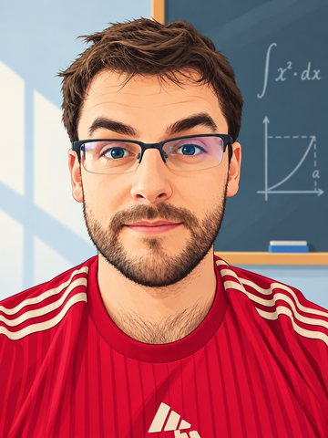

Theoretical physics · Gravitation · Quantum field theory

# Pablo Bueno

I am a theoretical physicist and Professor Agregat at the Institute of Cosmos Sciences of the University of Barcelona (ICCUB). I work on black holes, gravitational theories beyond General Relativity, quantum field theory, entanglement and holography.

Professor Agregat · Universitat de Barcelona
ICCUB
Barcelona

<a class="pb-button primary" href="research.html">Research</a>
<a class="pb-button secondary" href="people.html">People</a>
<a class="pb-button secondary" href="career.html">Career</a>

## About me

I am from **Tineo, Asturias**, and currently live in **Barcelona with my wife and our two cats**. My family is originally from **A Fonsagrada, Lugo**, in eastern Galicia, close to the Asturian border. My academic path has taken me through Oviedo, Madrid, Waterloo, Leuven, Amsterdam, Bariloche, CERN and Barcelona.

Most of my work is driven by a simple question: **which features of gravity and quantum field theory are genuinely universal, and which depend on the particular language or model we use to describe them?**

Outside physics, I am also an **economist in training**, currently pursuing undergraduate studies in Economics through UNED.

## Contact

**Institute of Cosmos Sciences (ICCUB)**  
**Universitat de Barcelona**  
Barcelona, Spain

[pablobueno@ub.edu](mailto:pablobueno@ub.edu)

## Tineo and A Fonsagrada

I grew up in **Tineo**, in western Asturias. For a visual impression of the area, see the [official Tineo tourism site](https://turismotineo.es/) or the [Wikimedia Commons gallery for Tinéu](https://commons.wikimedia.org/wiki/Category:Tin%C3%A9u).

My family roots are in **A Fonsagrada**, in the province of Lugo, Galicia. It is a mountainous area bordering Asturias, part of the Eo-Oscos e Terras de Burón Biosphere Reserve, and closely tied to the **Camino Primitivo**. For a visual impression of the area, see [A Fonsagrada on the Lugo tourism portal](https://turismo.deputacionlugo.gal/en/conece/lugoinedito/fonsagrada) or the [Galicia tourism information](https://www.turismo.gal/recurso/-/detalle/276943797/oficina-de-turismo-de-a-fonsagrada?langId=en_US).
